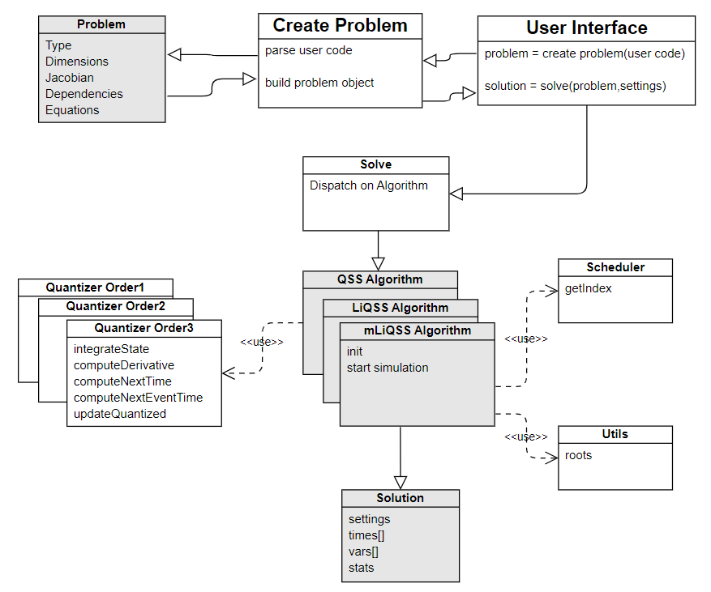

# Developer Guide

## Contribution

QuantizedSystemSolver is a collaborative project open to contributions. If you want to contribute, please take into account:

  - Carefully read and follow this guide. 
  - Before opening a PR with a significant contribution, contact the project administrators, e.g., by writing an email to bellilimongi@gmail.com or by opening an issue describing what you are willing to implement. Wait for feed-back.
  - Open a PR with your contribution.


If you want to help further develop this package, follow these steps:
```console
$ git clone https://github.com/mongibellili/QuantizedSystemSolver.jl.git /some/path/
julia

julia> ]

(@v1.x) pkg> dev("/some/path/")
```

Want to help in other ways? We have a number of [issues](https://github.com/mongibellili/QuantizedSystemSolver.jl/issues). You can start contributing to the project by solving some of those issues. 


## Style Guides

* PascalCase for typenames
* AllCAPS for acronyms
* Use camelCase for variables, methods and file names, with underscores only when necessary
* For the user API, adhere to the DifferentialEquation.jl interface
* Use lowercase for algorithm names.
* Use inline comments when necessary
* Use method! for muting methods
* Wrap multiline expressions in parentheses to avoid errors

See [the Julia CONTRIBUTING.md](https://github.com/JuliaLang/julia/blob/master/CONTRIBUTING.md) for further information.

## Components overview
While the package is optimized to be fast, extensibility is not compromised. It is divided into 3 entities that can be extended separately: Problem, Algorithm, and Solution. The package uses other packages such as MacroTools.jl for user-code parsing, SymEngine.jl for Jacobian computation, and a modified TaylorSeries.jl that uses caching to obtain free Taylor variables. 
The other components of the solver include the NLodeProblem function, the solve function, the scheduler, and the quantizer. The following sections provide an in-depth explanation of the key components and their interactions within the solver framework.
::: center


## Future work

  - Currently, to introduce an event the user must define the condition of the event in this syntax: condition>0. We want to improve the way to define the conditions to include any boolean entry instead. 
  - Improve the performance of constructing the problem using ODEProblem (similar to the performance when using @NLodeProblem).
  - Extend the quantizer to handle order 3.
  - Create more functions to the Taylor object.

