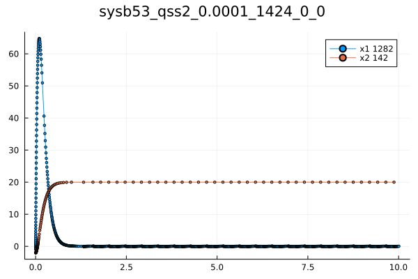
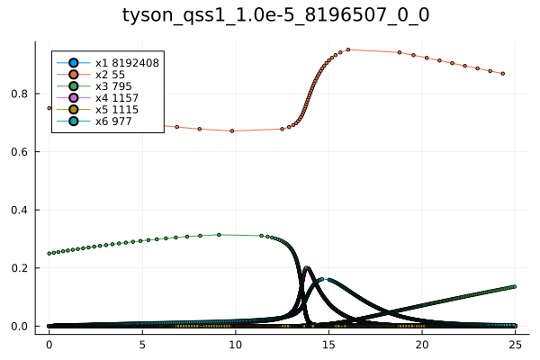
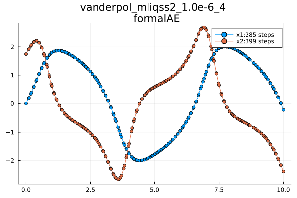
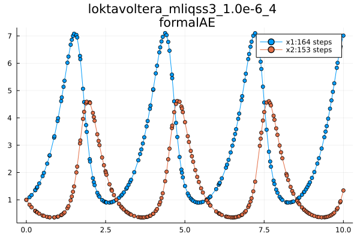
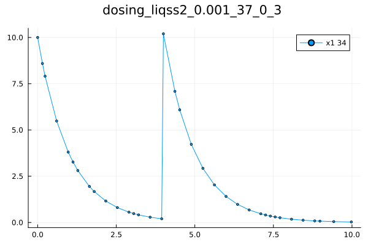

# Examples 

### Systems of 2 Linear Time Invariant Differential equations
```julia
odeprob = NLodeProblem(quote
     name=(sysb53,)
    u = [-1.0, -2.0]
    du[1] = -20.0*u[1]-80.0*u[2]+1600.0
    du[2] =1.24*u[1]-0.01*u[2]+0.2
end)  
tspan=(0.0,1.0)
```
This is a great example that shows when we need to use the explicit qss, the implicit liqss, or the modified implicit nmliqss. This is a stiff problem so we need to use the implicit methods, but it also contains larger entries outside the main diagonal of the Jacobian. Therefore, nmliqss should the most appropriate algorithm to use. The nmliqss plot does not finish at the final time because it terminated when it reached the equilibrium in which the values are the same as the values at the final time.

```julia
sol=solve(odeprob,qss1(),tspan)
save_Sol(sol)
```

```julia
sol=solve(odeprob,qss2(),tspan)
save_Sol(sol)
```

```julia
sol=solve(odeprob,liqss1(),tspan)
save_Sol(sol)
```

```julia
sol=solve(odeprob,liqss2(),tspan)
save_Sol(sol)
```

```julia
sol=solve(odeprob,nmliqss1(),tspan)
save_Sol(sol)
```

```julia
sol=solve(odeprob,nmliqss2(),tspan)
save_Sol(sol)
```


### The Tyson Model
```julia
function test(solvr,absTol,relTol)
odeprob = NLodeProblem(quote
    name=(tyson,)
    u = [0.0,0.75,0.25,0.0,0.0,0.0]
    du[1] = u[4]-1e6*u[1]+1e3*u[2]
    du[2] =-200.0*u[2]*u[5]+1e6*u[1]-1e3*u[2]
    du[3] = 200.0*u[2]*u[5]-u[3]*(0.018+180.0*(u[4]/(u[1]+u[2]+u[3]+u[4]))^2)
    du[4] =u[3]*(0.018+180.0*(u[4]/(u[1]+u[2]+u[3]+u[4]))^2)-u[4]
    du[5] = 0.015-200.0*u[2]*u[5]
    du[6] =u[4]-0.6*u[6]
end ) 
println("start tyson solving")
tspan=(0.0,25.0)
sol=solve(odeprob,solvr,abstol=absTol,reltol=relTol,tspan)
println("start saving plot")
save_Sol(sol)
end

absTol=1e-5
relTol=1e-2
solvrs=[qss1(),liqss1(),nmliqss1(),nmliqss2()]
for solvr in solvrs
    test(solvr,absTol,relTol)
end
```
This model also is stiff and it needs a stiff method, but also the normal liqss will produce unnecessary cycles. Hence, the nmliqss is again the most appropriate.




###    Oregonator; Vanderpl; Loktavoltera






### Bouncing Ball

```julia
odeprob = NLodeProblem(quote 
    name=(sysd0,)
    u = [50.0,0.0]
    discrete=[0.0]
    du[1] = u[2]
    du[2] = -9.8#+discrete[1]*u[1]
  
    if -u[1]>0.0
        u[2]=-u[2]
    end
end)  
tspan=(0.0,15.0)
sol=solve(odeprob,qss2(),tspan)
```


### Conditional Dosing in Pharmacometrics

This section shows [the Conditional Dosing in Pharmacometrics](https://docs.sciml.ai/DiffEqDocs/stable/examples/conditional_dosing/) example tested using the Tsit5() of the DifferentialEquations.jl

```julia
odeprob = NLodeProblem(quote 
    name=(sysd0,)
    u = [10.0]
    discrete=[-1e5]
    du[1] =-u[1]
    if t-4.0>0.0
        discrete[1]=0.0
    end
    if t-4.00000001>0.0
        discrete[1]=-1e5
    end
    if discrete[1]+(4.0-u[1])>0.0
        u[1]=u[1]+10.0
    end
end)  
tspan=(0.0,10.0)
sol=solve(odeprob,nmliqss2(),tspan)
save_Sol(sol)
```

The condition t == 4 && u[1] < 4 can be replaced by using another discrete variable (flag) that is triggered when t==4 , and it triggers the check of  u[1] < 4.




