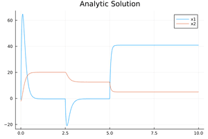

# Linear Time Invariant with events


The same previous LTI example is extended to contain events (discontinuities). At times 2.5 and 5.0 the differential equations are changed. This is modeled through discrete variables passed in the p vector. The events are defined through ``if-statements``.
```julia
using QuantizedSystemSolver
function sysb53(du,u,p,t)
    du[1] = p[1]*u[1]+p[2]*u[2]+p[3]
    du[2] = p[4]*u[1]+p[5]*u[2]+p[6]
    if t-2.5>0.0
        p[1]=-22.0
        p[3]=1000.0
    end
    if t-5.0>0.0
        p[2]=-20.0
        p[5]=-10.0
        p[6]=-0.5
    end
end
tspan = (0.0,7.0)
u0= [-1.0, -2.0]
p=[-20.0,-80.0,1600.0,1.24,0.01,0.2]
prob = ODEProblem(funcName,u0,tspan,p)
#Solve the problem
sol = solve(odeprob,nmliqss2()abstol = 1e-4, reltol = 1e-2)
p1 = plot(sol);
```

The analytic solution is given by the following equations:
```julia
using Plots
function A1() 
    x1(t)=105.83453057676363*-8.83362618880318*exp(-10.943696474115944*t)-127.91533865757171*-7.303470585390368*exp(-9.046303525884058*t)-0.32323232323231316
    x2(t)=105.83453057676363*exp(-10.943696474115944*t)-127.91533865757171*exp(-9.046303525884058*t)+20.08080808080808
    return (x1,x2) 
end   
function B1() 
    x1(t)=-5.300798816237515e17*-12.649850456341543*exp(-15.675814565863513*t)+9.014692147675046e7*-5.10014954365846*exp(-6.314185434136489*t)-0.26267932915740405
    x2(t)=-5.300798816237515e17*exp(-15.675814565863513*t)+9.014692147675046e7*exp(-6.314185434136489*t)+12.572236815518284
    return (x1,x2) 
end 
function C1() 
    x1(t)=4.746452513218909e42*-7.537612988819599*exp(-19.346640106136302*t)+8.75190264440514e27*-2.139806366019111*exp(-12.653359893863698*t)+40.890522875817
    x2(t)=4.746452513218909e42*exp(-19.346640106136302*t)+8.75190264440514e27*exp(-12.653359893863698*t)+5.020424836601308
    return (x1,x2) 
end 
function x1(t)
    if t<2.5
        return A1()[1](t)
    elseif t<5.0
        return B1()[1](t)
    else
        return C1()[1](t)
    end
end
function x2(t)
    if t<2.5
        return A1()[2](t)
    elseif t<5.0
        return B1()[2](t)
    else
        return C1()[2](t)
    end
end
p1=plot!(x1,0,10,label="x1")
p1=plot!(x2,0,10,label="x2")
```


Then use DifferentialEquations instead of QuantizedSystemSolver, and use callbacks instead of ``if-statements``.
```julia
using DifferentialEquations
function funcName(du,u,p,t)
    du[1] = p[1]*u[1]+p[2]*u[2]+p[3]
    du[2] = p[4]*u[1]+p[5]*u[2]+p[6]
end
tspan = (0.0,10.0)
u0= [-1.0, -2.0]
p=[-20.0,-80.0,1600.0,1.24,0.01,0.2]
prob = ODEProblem(funcName,u0,tspan,p)
absTol=1e-4
relTol=1e-2
function condition1( u, t, integrator) 
    (t-2.5)
end
function condition2( u, t, integrator) 
    (t-5.0)
end
function affect1!(integrator)
    p[1]=-22.0
    p[3]=1000.0
end
function affect2!(integrator)
    p[2]=-20.0
    p[5]=-10.0
    p[6]=-0.5
end
cb1 = ContinuousCallback(condition1, affect1!,nothing;  )
cb2 = ContinuousCallback(condition2, affect2!,nothing; )
cbs = CallbackSet(cb1, cb2)
solRosenbrock23 = solve(prob,Rosenbrock23(),callback = cbs,abstol = absTol, reltol = relTol) 
p1=plot!(solRosenbrock23,title="Rosenbrock23")
```

The plots are displayed below:


 **LTI with events using QuantizedSystemSolver.jl**


 **LTI with events using DifferentialEquation.jl**


**LTI with events using the analytic solution**




