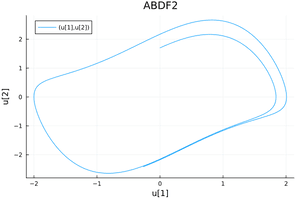

# Van der Pol

The Van der Pol oscillator is a nonlinear system that is often used to model biological rhythms, electrical circuits, and other systems with nonlinear dynamics. The equations for the Van der Pol oscillator are:
```math
\begin{align*}
\dot{x} &= y, \\
\dot{y} &= (1 - x^2)y - x,
\end{align*}
```


The QuantizedSystemSolver code to solve this system:
```julia
using QuantizedSystemSolver
function vanderpol(du,u,p,t)
    du[1] = u[2]
    du[2] = (1.0-u[1]*u[1])*u[2]-u[1] 
end
u0 = [0.0,1.7];tspan=(0.0,10.0)
#Construct the problem
odeprob = ODEProblem(vanderpol,u0,tspan)
#Solve the problem
sol=solve(odeprob,nmliqss2())
p1=plot(sol);
savefig(p1, "vanderpol_$(nmliqss2())") 
```
Replace nmliqss2 by ABDF2() from the DifferentialEquations.jl, to obtain the following plots.


Variable 2 can viewed wrt variable 1 using:
```julia
p1=plot(sol,idxs=(1,2),title="...");
```

