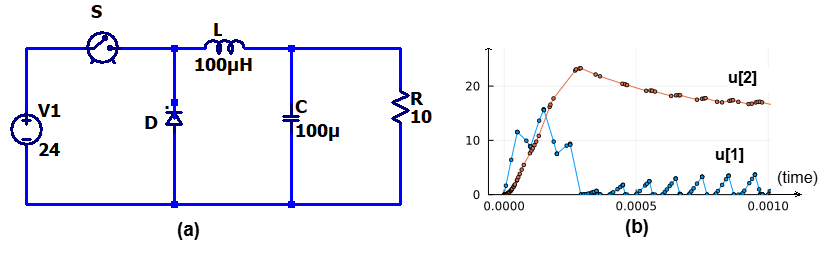
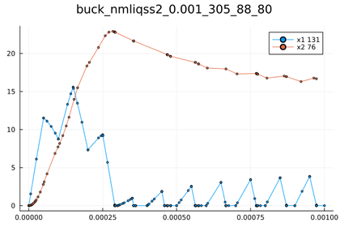
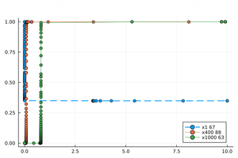

# Summary

Contemporary engineering systems, such as electrical circuits, mechanical systems with shocks, and chemical reactions with rapid kinetics, are often characterized by dynamics that can be modeled using stiff differential equations with events. Stiffness typically arises in these systems due to the presence of both rapidly changing and slowly changing components. This stiffness requires extremely small time steps to maintain stability when using traditional numerical integration techniques. Recently, quantization-based techniques have emerged as an effective alternative for handling such complex models. Methods like the Quantized State System (QSS) and the Linearly Implicit Quantized State System (LIQSS) offer promising results, particularly for large sparse stiff models. Unlike classic numerical integration methods, which update all system variables at each time step, the quantized approach updates individual system variables independently. Specifically, in quantized methods, each variable is updated only when its value changes by a predefined quantization level resulting in only updating the rapidly changing components. Moreover, these methods are advantageous when dealing with discontinuous events, where traditional integrators may struggle with accuracy. An event is a discontinuity where the state of the system abruptly changes at a specific point. Classic methods either undergo expensive iterations to pinpoint the exact discontinuity instance or resort to interpolating its location, resulting in unreliable outcomes. Therefore, this QSS strategy can significantly reduce computational effort and improve efficiency in large sparse stiff models with frequent discontinuities [@improveliqss].

# Statement of need

Traditional solvers are challenged by large sparse stiff models and systems with frequent discontinuities. As an example, the Advection Diffusion Reaction (ADR) problem is a large sparse stiff system that classic methods can not efficiently solve. In addtion, the buck converter is a stiff system with frequent discontinuities that classic solvers from the DifferentialEquations.jl [@Rackauckas2017] are currently unable to handle properly.  
Written in the easy-to-learn [Julia programming language](https://julialang.org) [@julia], inspired by the [`qss-solver`]( https://github.com/CIFASIS/qss-solver)[@qssC] written in C, and taking advantage of the Julia features such as multiple dispatch and metaprogramming, the QuantizedSystemSolver.jl package shares the same interface as DifferentialEquations.jl package and aims to efficiently solve a large set of stiff Ordinary Differential Equations (ODEs) with a set of events via implementing the QSS and LIQSS methods. It is the first such tool to be published in the Julia ecosystem. This package is able to easily solve the ADR and the buck converter problems as shown in the examples section.

# Quantization-based techniques
The main idea behind QSS methods is to divide the system state space into quantized regions and represent the system state in terms of these quantized values. The QSS methods update the system status only when certain thresholds or conditions are met, instead of continuously simulating the system's behavior. For instance, state variables with large gradients will get to their thresholds more frequently than states with small gradients. If a state or input gets to its next threshold, a discrete event is triggered, and information is passed on to other integrators that depend on it [@fe2006a].
The general form of a problem composed of a set of ODEs and a set of events that QSS is able to solve is described in the following: 


$\dot X=f(X,P,t)$

$if \; zc_v(x_i...,p_d...,t) \; i \in [1,n]  \;  ; \; d  \in [1,m]$

$\qquad x_i=H_v(x_i...,p_d...,t)$

$\qquad p_d=L_v(x_i...,p_d...,t)$

$\qquad \qquad...$

where $X = [x_1,x_2...,x_n]^T$ is the state vector, $f:\mathbb{R}^n \rightarrow \mathbb{R}^n$ is the derivative function, and $t$ is the independent variable. $D = [d_1,d_2...,d_m]^T$ is the vector of the system discrete variables. $n$ and $m$ are the number of state variables and discrete variables of the system respectively. $v$ is the number of events and $zc$ is an event condition, $H$ and $L$ are functions used in the effects of the event $zc$.

In classic methods, the difference between $t_k$ (the current time) and $t_{k+1}$ (the next time) is called the step size. 
In QSS, besides the step size, the difference between $x_i(t_k)$ (the current value) and $x_i(t_{k+1})$ (the next value) is called the quantum $\Delta_i$. Depending on the type of the QSS method (explicit or implicit), a new variable $q_i$ is set to equal $x_i(t_k)$  or $x_i(t_{k+1})$ respectively. $q_i$ is called the quantized state of $x_i$, and it is used in updating the derivative function [@elbellili].

# Package description
While the package is optimized to be fast, extensibility is not compromised. It is divided into 3 entities that can be extended separately: ``problem``, ``algorithm``, and ``solution``. The rest of the code is to create these entities and glue them together as shown in Figure 1. The API was designed to match the differentialEquations.jl interace while providing an easier way to handle events. The problem is defined inside a function, in which the user may introduce any parameters, variables, equations, and events:
```julia
function func(du,u,p,t) 
  #parameters
  #helper expressions
  #differential equations
  #if-statments for events 
end
```

Then, this function is passed to an `ODEProblem` function along with the initial conditions, the time span, and any parameters or discrete variables. 
```julia
tspan = (initial_time,final_time)
u = [u1_0,u2_0...] #initial conditions
p = [p1_0,p2_0...] # parameters and discrete variables
odeprob=ODEProblem(func,u,tspan,p)
```

The output of the previous `ODEProblem` function, which is a QSS problem, is passed to a solver function with other configuration arguments
such as the algorithm type and the tolerance. The solve function dispatches on the given algorithm and starts the numerical integration.
```julia
sol = solve(odeprob,algorithm,abstol = ...,reltol = ...)    
```
At the end, a solution object is produced that can be queried, plotted, and error-analyzed.

```julia
sol(0.0005,idxs = 2) # get the value of variable 2 at time 0.0005
sol.stats          # get statistics about the simulation
plot(sol)          # plot the solution
```


In addition, the package contains several shared helper functions used during the integration process by the algorithm such as the scheduler that organizes which variable of the system to update at any specific time of the simulation. 
The solver uses other packages such as  [`MacroTools.jl`]( https://github.com/FluxML/MacroTools.jl) [@MacroTools] for user-code parsing, [`SymEngine.jl`]( https://github.com/symengine/SymEngine.jl) [@SymEngine] for Jacobian computation and dependencies extraction, and a modified [`TaylorSeries.jl`](https://github.com/JuliaDiff/TaylorSeries.jl/) [@TaylorSeries] that uses caching to obtain free Taylor variable operations as the current version of TaylorSeries creates a heap allocated object for every operation. The approximation through Taylor variables transforms any complicated equations to polynomials, which makes root finding cheaper, which the QSS methods relies heavily on it. 

# Examples
## The buck converter
The Buck is a converter that decreases voltage and increases current with a greater power efficiency than linear regulators [@buck]. Its circuit is shown in the following figure:



The diode $D$ and the switch $S$ can be modeled as two variables resistors $RD$ and $RS$. When the diode and the switch are ON, $RD$ and $RS$ are set to $10^{-5}$, and when they are OFF, they are set to $10^{5}$. The diode is ON when its current is positive. The switch is controlled by the voltage $SC$, and it is ON for $0.5$ x $10^{-4}$ seconds. A mesh and a nodal analysis give the relationship between the different components in the circuit as follows:

$i_d = \frac{RS.i_l-V1}{RS+RD}$

$\frac{du_c}{dt} = \frac{i_l-\frac{u_c}{R}}{C}$

 $\frac{di_l}{dt} = \frac{-uc-i_d.RD}{L}$


The buck problem can be solved by the QuantizedSystemSolver.jl package using the following code:

```julia
using QuantizedSystemSolver
function buck(du,u,p,t)
  #Constant parameters
  C = 1e-4; L = 1e-4; R = 10.0;V1 = 24.0; T = 1e-4; DC = 0.5; ROn = 1e-5;ROff = 1e5;
  #Optional rename of the continuous and discrete variables
  RD=p[1];RS=p[2];nextT=p[3];lastT=p[4];il=u[1] ;uc=u[2]
  #Equations
  id = (il*RS-V1)/(RD+RS) # diode's current
  du[1] = (-id*RD-uc)/L
  du[2] = (il-uc/R)/C
  #Events
  if t-nextT>0.0 # model when the switch is ON
    lastT = nextT;nextT=nextT+T;RS=ROn
  end
  if t-lastT-DC*T>0.0 # model when the switch is OFF
    RS = ROff
  end
  if id>0 # model when the Diode is ON
    RD = ROn;
  else
    RD = ROff;
  end
end
#Initial conditions and time settings
p = [1e5,1e-5,1e-4,0.0];u0 = [0.0,0.0];tspan = (0.0,0.001)
#Define the problem
QSSproblem = ODEProblem(buck,u0,tspan,p)
#solve the problem
sol = solve(QSSproblem,nmliqss2(),abstol = 1e-3,reltol = 1e-2)
#Get the value of variable 2 at time 0.0005 
sol(0.0005,idxs = 2)
#plot the solution
plot(sol)
```


## The Advection Diffusion Reaction problem


The Advection diffusion reaction  equations describe many processes that include heat transfer, chemical reactions and many phenomena in areas of environmental sciences. They are ordinary differential equations that resulted from the method of lines (MOL). The resulting system in Eq.(\ref{ADREq}) is a stiff system with possible large entries outside the main diagonal. :

$\text{For} \; i = 1...N-1$

$\quad \quad  \dot u_i = -a\frac{u_i-u_{i-1}}{\Delta x}+d\frac{u_{i+1}-2u_i+u_{i-1}}{\Delta x^2}+r(u_i^2-u_i^3)$

$\dot u_N = -a\frac{u_N-u_{N-1}}{\Delta x}+d \frac{2u_{N-1}-2u_N}{\Delta x^2}+r(u_N^2-u_N^3)$

where N is the number of grid points and $\Delta x=\frac{10}{N}$ is the grid width after the discretization of the problem with the MOL, $a$ is the advection parameter, $d$ is the diffusion parameter, and $r$ is the reaction parameter. The initial condition is given by:


$u_i(t=0) = 1 \;\;\;\;\; if \;\;\; i \in [1,N/3]$

$u_i(t=0) = 0 \;\;\;\; else$


The advection parameter is fixed at $a=1$, and the reaction parameter is fixed at $r=1000$. The number of grid points is picked as $N=1000$, and $d$ is set to 0.1 [@improveliqss].


The QuantizedSystemSolver code to solve this system:
```julia
using QuantizedSystemSolver
function adr(du,u,p,t)
  #Constant parameters
  _dx = 100.0;a = 1.0;d = 0.1;r = 1000.0
  #Equations
  du[1] = -a*_dx*(u[1]-0.0)+d*_dx*_dx*(u[2]-2.0*u[1]+0.0)+r*u[1]*u[1]*(1.0-u[1]) 
  for k in 2:999  
      du[k]=-a*_dx*(u[k]-u[k-1])+d*_dx*_dx*(u[k+1]-2.0*u[k]+u[k-1])+r*u[k]*u[k]*(1.0-u[k]) ;
  end 
  du[1000]=-a*_dx*(u[1000]-u[999])+d*_dx*_dx*(2.0*u[999]-2.0*u[1000])+r*u[1000]*u[1000]*(1.0-u[1000]) 
end
tspan = (0.0,10.0)
u0=zeros(1000)
u0[1:333] .= 1.0
#Construct the problem
odeprob = ODEProblem(adr,u0,tspan)
#Solve the problem
sol = solve(odeprob,nmliqss2(),abstol = 1e-3,reltol = 1e-2)
#Plot variables 1,400,1000
p1 = plot(sol,idxs = [1,400,1000],title = "");
```


This is a great example to compare QSS methods against classic integration methods, because it is a large sparse stiff system.
Replacing nmliqss2 by solvers such as ABDF2(), QNDF2(), QBDF2(), Rosenbrock23, or Trapezoid() from the DifferentialEquations.jl produce the following CPU time comparison:


# Conclusion
The package provides powerful functionality to efficiently solve stiff ODEs with events using the quantized state method. It is lightweight and well-documented, making it accessible for researchers and students across various domains. Additionally, users can extend its capabilities by defining their own subclasses of the abstract types (``problem``, ``algorithm``, and ``solution``) to handle different problem types.

# Acknowledgements
This research has received no external funding.

# References
